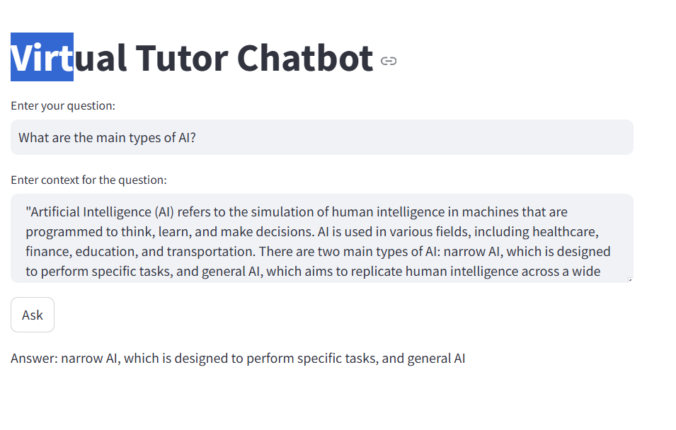
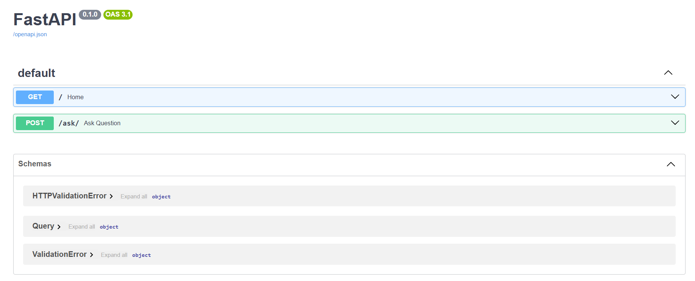

# Virtual Tutor Chatbot

## Overview
The Virtual Tutor Chatbot is a conversational AI application built using **FastAPI** and **Streamlit**, designed to answer questions based on provided context. It is versatile and can be tailored for various educational use cases, such as **Islamic Q&A**, **general knowledge assistance**, or even as a **learning companion**.

This project demonstrates how to integrate state-of-the-art NLP models from **Hugging Face** with a clean, user-friendly interface for practical use cases.

---

## Features
- **Interactive Q&A:** Provides answers to user questions based on a specific context.
- **Hugging Face Integration:** Uses the `distilbert-base-cased-distilled-squad` model for question answering.
- **User-Friendly Interface:** Developed with **Streamlit** for an intuitive and responsive UI.
- **Scalable Backend:** Powered by **FastAPI**, making it easy to extend and deploy.
- **Educational Use Cases:** Ideal for building subject-specific tutors like Islamic Q&A, historical facts, or general assistance.

---

## How to Run

### Prerequisites
- Python 3.8, 3.9, or 3.10
- Git

### Steps
1. **Clone the repository:**
   ```bash
   git clone https://github.com/ijlalkhanzada/virtual-tutor.git
   cd virtual-tutor
   ```

2. **Set up a virtual environment:**
   ```bash
   python -m venv venv
   source venv/bin/activate  # On Windows: venv\Scripts\activate
   ```

3. **Install dependencies:**
   ```bash
   pip install -r requirements.txt
   ```

4. **Run the Backend:**
   ```bash
   uvicorn app:app --reload
   ```

5. **Run the Frontend:**
   ```bash
   streamlit run frontend.py
   ```

6. **Access the Application:**
   - **Frontend (Streamlit):** Open `http://localhost:8501` in your browser.
   - **Backend (FastAPI):** Open `http://127.0.0.1:8000/docs` for API documentation.

---

## Usage

1. Open the **Streamlit interface** in your browser (`http://localhost:8501`).
2. Enter the **context** and **question** in the provided fields.
3. Submit your input to receive an answer from the chatbot.
4. **Example Input**:
   - **Context:** "Artificial Intelligence is the simulation of human intelligence in machines."
   - **Question:** "What is Artificial Intelligence?"
5. **Expected Output**:
   - **Answer:** "Artificial Intelligence is the simulation of human intelligence in machines."
6. **Screenshots Section:** Makes the project visually appealing (add images).

---

## Screenshots

### 1. Streamlit Interface


### 2. FastAPI Swagger Docs



## Architecture

### Technologies Used
- **FastAPI:** For backend API development.
- **Streamlit:** For frontend UI.
- **Hugging Face Transformers:** For NLP models.
- **Uvicorn:** ASGI server to run the FastAPI app.

### Workflow
1. User inputs a question and context in the **Streamlit frontend**.
2. The frontend sends the data to the **FastAPI backend**.
3. The backend uses **Hugging Face Transformers** to process the input and generate an answer.
4. The answer is returned to the frontend and displayed to the user.

---

## Future Enhancements
- **Multilingual Support:** Add support for multiple languages.
- **Voice Interaction:** Integrate speech-to-text and text-to-speech.
- **Custom Models:** Allow users to train or select custom models.
- **Cloud Deployment:** Deploy the chatbot on Heroku or AWS for global access.

---

## Contact
For any questions or feedback:
- **Name:** Ijlal Khanzada
- **GitHub:** [https://github.com/ijlalkhanzada](https://github.com/ijlalkhanzada)
